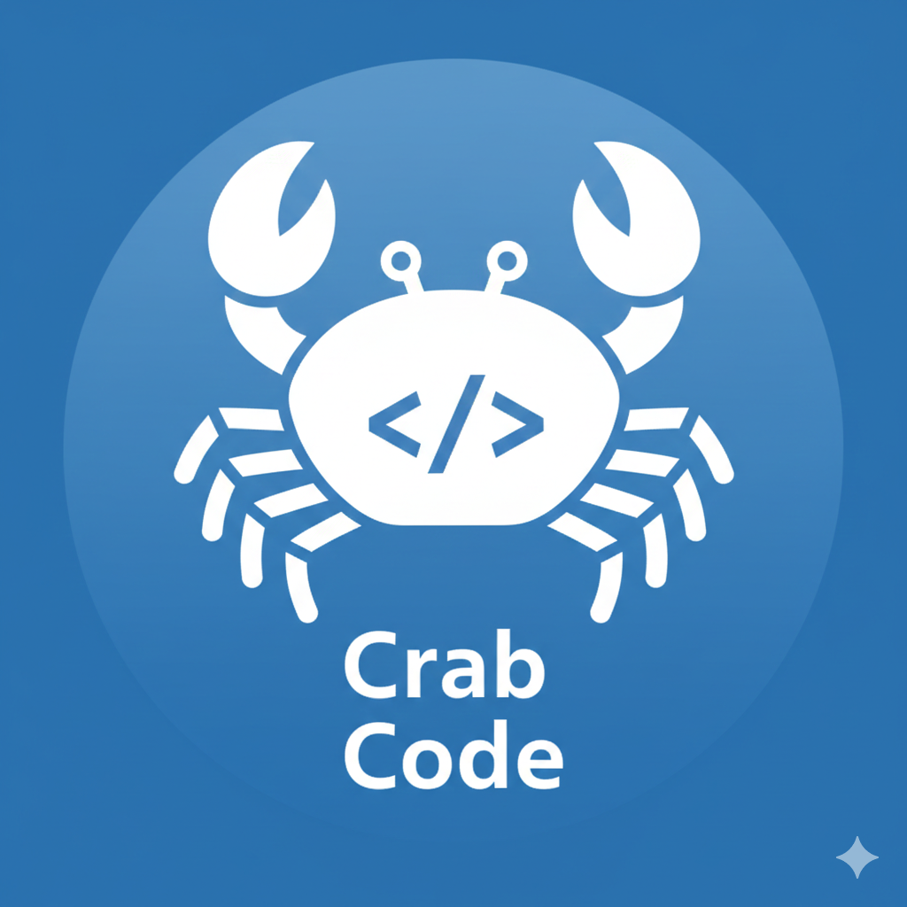

<div align="center">



# CrabCode IDE

**Uma IDE de programação em português, direto no navegador.**

[](https://armandoerthalcarvalho.github.io/Crab-Code-IDE/)
[]()
[]()

[🚀 Experimente Agora](https://armandoerthalcarvalho.github.io/Crab-Code-IDE/) · [📖 Documentação embutida](#) · [🐛 Reportar Bug](https://github.com/armandoerthalcarvalho/Crab-Code-IDE/issues)

</div>

---

## 📌 O que é o CrabCode?

**CrabCode** é uma IDE educacional completa que funciona diretamente no navegador, sem instalação. Ela permite aprender lógica de programação usando uma **linguagem própria em português**, com sintaxe simples e amigável — ideal para iniciantes, estudantes do ensino fundamental e médio, e qualquer pessoa que queira dar os primeiros passos na programação.

Além do lado educacional, o CrabCode é equipado com um ecossistema de **bibliotecas matemáticas e científicas** voltadas à análise STEM, tornando-o também útil para cálculos e visualizações mais avançadas.

> 💡 **Tudo acontece no navegador.** Nenhuma instalação, nenhum servidor, nenhuma conta necessária.

---

## ✨ Funcionalidades

| Funcionalidade | Descrição |
|---|---|
| 🧠 **Linguagem própria em PT-BR** | Sintaxe simples e legível em português (`defina`, `se`, `repita`, `apresente`...) |
| ⚡ **Execução em sandbox** | Código roda de forma segura num iframe isolado, sem risco ao navegador |
| 🎨 **Destaque de sintaxe** | Colorização em tempo real enquanto você digita |
| 🔍 **Autocompletar** | Sugestões inteligentes de palavras-chave, funções e variáveis |
| ⚠️ **Painel de erros** | Erros de léxico e sintaxe exibidos em tempo real com número de linha |
| 📚 **Tutorial interativo** | Tutorial completo embutido na própria IDE |
| 📖 **Documentação embutida** | Referência completa da linguagem acessível com um clique |
| 📊 **Sistema de Dados (CSV)** | Importe tabelas CSV e use os dados diretamente no código |
| 🔧 **Bibliotecas oficiais** | Conjunto de bibliotecas matemáticas, estatísticas e STEM prontas para uso |
| 🛠️ **Bibliotecas personalizadas** | Crie e salve suas próprias bibliotecas em CrabCode |
| 💾 **Scripts salvos** | Salve, organize e recarregue seus projetos localmente |
| 🌙 **Tema claro/escuro** | Alternância entre tema escuro (Catppuccin Mocha) e claro |
| 📷 **Exportar como PNG** | Exporte seu código como imagem |
| 📄 **Exportar como PDF** | Gere um PDF com código e output |
| 🖥️ **Modo Apresentação** | Exibe o output em tela cheia para apresentações |
| ↔️ **Painel redimensionável** | Ajuste o espaço entre editor e output arrastando o divisor |

---

## 🗣️ Sintaxe da Linguagem

O CrabCode usa uma linguagem de programação própria com palavras-chave em português. Veja alguns exemplos:

### Variáveis e saída
```
defina nome como "João"
defina idade como 17

apresente "Olá, " + nome em texto
apresente "Idade: " + idade em destaque
```
### Condicionais
```
defina nota como 7

execute "Aprovado" se nota >= 7 senao "Reprovado"
```

### Laços de repetição
```
execute 'Crab Code é Incrível!' repita 5 vezes
  
defina i como 1
altere i para i+1 enquanto i<10
```

### Funções
```
defina dobrar como funcao(x)
  execute x * 2

apresente rodar(execute dobrar(6)) em apresentação
```

### Importando bibliotecas
```
importe biblioteca_geral
importe estatistica

apresente rodar(execute fatorial(5)) em apresentação
apresente rodar(execute media([10, 20, 30])) em dados
```

### Usando datasets CSV
```
importe vendas

apresente media(total) em dados
apresente soma(lucro) em apresentação
```

---

## 🚀 Como usar

### ▶ Opção 1 — Demo Online (recomendado)

Acesse diretamente no navegador, sem instalar nada:

**[https://armandoerthalcarvalho.github.io/Crab-Code-IDE/](https://armandoerthalcarvalho.github.io/Crab-Code-IDE/)**

---

### 💻 Opção 2 — Rodar localmente

> ⚠️ **Importante:** por usar ES6 Modules nativos, o projeto **precisa ser servido via HTTP** — não funciona ao abrir o `index.html` diretamente pelo explorador de arquivos (`file://`).

**1. Clone o repositório:**
```bash
git clone https://github.com/armandoerthalcarvalho/Crab-Code-IDE.git
cd Crab-Code-IDE
```

**2. Inicie um servidor local.** Escolha uma das opções abaixo:

```bash
# Python 3
python -m http.server 8080

# Node.js (npx, sem instalação)
npx serve .

# VS Code: instale a extensão "Live Server" e clique em "Go Live"
```

**3. Abra no navegador:**
```
http://localhost:8080
```

---

## 📁 Estrutura do Projeto

```
CrabCode/
│
├── index.html              # Shell HTML — estrutura da UI
│
├── assets/
│   ├── crabcode_logo.png   # Logo do projeto
│   └── css/
│       └── styles.css      # Todos os estilos (tema claro/escuro, componentes)
│
└── js/
    ├── main.js             # Ponto de entrada — inicialização e eventos
    ├── language.js         # Motor da linguagem: Lexer → Parser → Transpiler → Runtime
    ├── editor.js           # Editor: destaque de sintaxe, AutoComplete, gerenciador de erros
    ├── output.js           # Renderizador de output (OutputRenderer)
    ├── storage.js          # localStorage: código, scripts, datasets CSV
    ├── libs.js             # UI de bibliotecas (oficiais e personalizadas)
    ├── themes.js           # Alternância de tema claro/escuro
    ├── tutorial.js         # Conteúdo do tutorial e documentação
    └── utils.js            # Utilitários compartilhados (escapeHtml, highlightLine)
```

---

## 🏗️ Arquitetura

O CrabCode implementa um pipeline de compilação completo do zero, puramente em JavaScript:

```
Código CrabCode (texto)
        │
        ▼
    ┌─────────┐
    │  Lexer  │  Tokenização — converte texto em tokens tipados
    └────┬────┘
         │ tokens
         ▼
    ┌─────────┐
    │ Parser  │  Análise sintática — constrói AST (Árvore Sintática Abstrata)
    └────┬────┘
         │ AST
         ▼
    ┌────────────┐
    │ Transpiler │  Geração de código — converte AST em JavaScript
    └─────┬──────┘
          │ JS code
          ▼
    ┌─────────┐
    │ Runtime │  Execução segura em sandbox (iframe isolado)
    └─────────┘
          │
          ▼
      Output renderizado na tela
```

**Módulos ES6 nativos** — nenhum bundler (webpack, vite, etc.) é necessário.

---

## 📚 Bibliotecas Disponíveis

### Bibliotecas Oficiais
| Biblioteca | Descrição |
|---|---|
| `biblioteca_geral` | Funções matemáticas gerais (fatorial, potência, área...) |
| `estatistica` | Média, mediana, moda, desvio padrão, variância |
| `financeiro` | Juros simples e compostos, amortização, investimentos |
| `fisica` | Cinemática, dinâmica, termodinâmica, óptica |
| `quimica` | Estequiometria, concentração, gases ideais |
| *(e mais...)* | Acesse a aba **Bibliotecas** na IDE para ver todas |

### Bibliotecas Personalizadas
Você pode criar suas próprias bibliotecas diretamente no CrabCode e reutilizá-las em qualquer projeto.

---

## ⌨️ Atalhos de Teclado

| Atalho | Ação |
|---|---|
| `Ctrl + Enter` | Executar código |
| `Ctrl + S` | Salvar manualmente |
| `Ctrl + L` | Limpar output |
| `Tab` | Indentar (2 espaços) |
| `Esc` | Sair do modo apresentação |

---

## 🌐 Compatibilidade

O CrabCode funciona em qualquer navegador moderno com suporte a ES6 Modules:

| Navegador | Suporte |
|---|---|
| Google Chrome 61+ | ✅ |
| Mozilla Firefox 60+ | ✅ |
| Microsoft Edge 79+ | ✅ |
| Safari 10.1+ | ✅ |
| Opera 48+ | ✅ |

> ❌ **Internet Explorer não é suportado.**

---

## 🤝 Contribuindo

Contribuições são muito bem-vindas! Se você encontrou um bug, tem uma ideia de melhoria ou quer adicionar suporte a novos recursos da linguagem, siga os passos:

1. **Fork** o repositório
2. Crie uma **branch** para sua feature:
   ```bash
   git checkout -b feature/minha-feature
   ```
3. Faça suas alterações e **commit**:
   ```bash
   git commit -m "feat: descrição da minha feature"
   ```
4. Envie para o seu fork:
   ```bash
   git push origin feature/minha-feature
   ```
5. Abra um **Pull Request** descrevendo o que foi feito

### Diretrizes
- Mantenha o código em **JavaScript puro** (sem frameworks ou bundlers)
- Novos tokens e palavras-chave devem ser adicionados em `js/language.js`
- Novas bibliotecas seguem o padrão do objeto `CrabLibRegistry.official` em `js/language.js`
- Novas funcionalidades de UI devem ser conectadas via `addEventListener` em `js/main.js` (sem `onclick` inline)

---

## 🐛 Reportando Bugs

Encontrou um problema? Abra uma [Issue no GitHub](https://github.com/armandoerthalcarvalho/Crab-Code-IDE/issues) com:

- Descrição clara do problema
- Passos para reproduzir
- Comportamento esperado vs. comportamento atual
- Navegador e versão utilizados
- (se possível) O código CrabCode que causou o erro

---

## 📜 Licença

© 2026 **Armando Erik Erthal de Carvalho** — Todos os direitos reservados.

Este projeto **não possui licença de código aberto**. O código-fonte está disponível publicamente para fins de estudo e demonstração, mas **não é permitido** copiar, distribuir, modificar ou utilizar comercialmente sem autorização expressa do autor.

Para solicitar permissão de uso, entre em contato através do GitHub: [@armandoerthalcarvalho](https://github.com/armandoerthalcarvalho)

---
